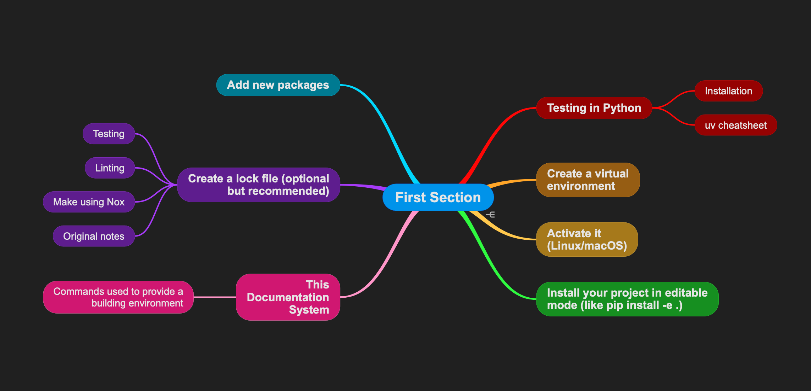

# Creating a MindMap

{ width=50% style="display:block;margin:0 auto;" }

You can call the utility __gen_section_mindmap.bash__ to generate a text file, that later can be open with MindMap Pro.

Example:

```bash
./gen_section_mindmap.bash sections/s_01 > top_concepts_of_section_01.txt
```

The headers #, ##, ###, #### and lists that have emphasis (eg: `-**Important concept**:`) get compiled and the hierarchy is kept.
